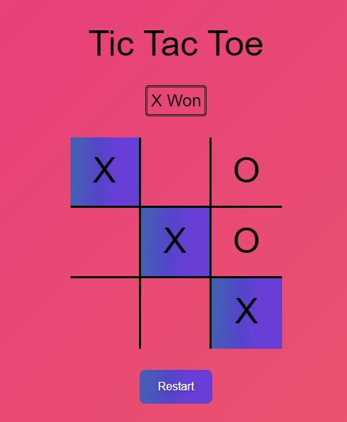

# hafta1-odev2
<strong>2-) Tic Tac Toe Uygulaması</strong> 
https://nostalgic-archimedes-b2b509.netlify.app/  

 
<strong>2-) Tic Tac Toe Uygulaması</strong>

3x3, 9 kutudan oluşan bir yapı tasarlanacak. 
Yatay, dikey veya çapraz bir şekilde x-x-x veya o-o-o 3lüsü oluşturan taraf kazanan oyuncu olacak. 3lü oluşmazsa oyun berabere sonuçlanacak. Oyun sonucu bir metin ile bildirilmeli.
(html,css ve javascript kullanılarak yapılacak)
(querySelector ile html elementlerine erişim sağlayabilirsiniz)
(style, classList ile stillerle oynayabilirsiniz)
(addEventListener ile kullanıcı etkileşimlerini yakalayabilirsiniz)
