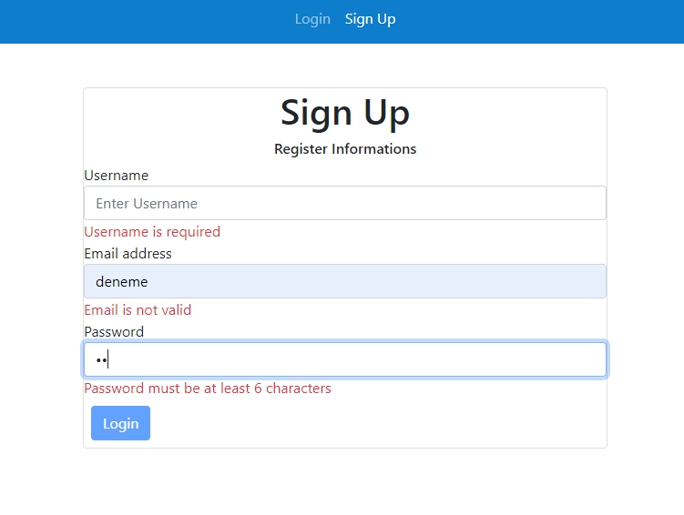
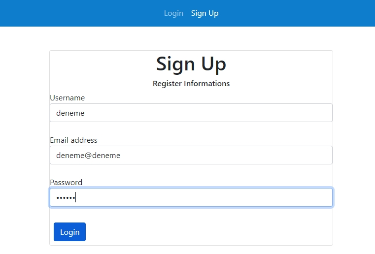
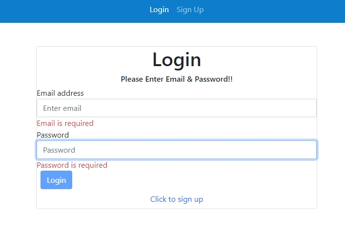
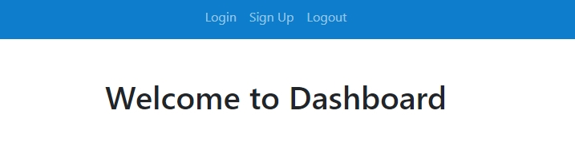

# 3. Hafta Ödevi
# Reactive Form and Validation
Sign up, Login ve Homepage componentleri yapıldı. Reactive form kullanılarak sign up ve log in componentlerinde gerekli validasyonlar sağlandı(Geçersiz giriş yapıldığından submit butonu tamamen kapatıldı bu sayede hatalı routing olmaması sağlandı). Başarılı sign up olunca post isteği yapılıyor, local storage'a veri kaydediliyor ve login sayfasına yönelendirme yapılıyor. Login sayfasında get ve find ile kullanıcı kontrolü yapılıyor, başarılı login olunca da homepage sayfasına yönlendirme yapılıyor.

Bir web uygulamasında kullanıcı kaydı ve kullanıcı girişi demosu hazırlayınız. Reactive form yaklaşımı kullanınız ve validasyonlarla 
uygulamanın güvenilirliğini sağlayınız. Hata mesajları ile kullanıcı dostu bir tasarım kurgulayınız. Kullanıcı kayıtlarını bir json dosyasına
yazdırıp, kullanıcı girişi yapılırken bu json dosyasından kontrol sağlayınız. Kullanıcı girişi yapıldıktan sonra herhangi bir içerik gösteriniz.
Kullanıcı girişi yapılmadan uygulama da ki içerikler görüntülenmemlidir. 
(Kullanıcı girişi yapıldıktan sonra, Local Storage da kullanıcı bilgileri saklanabilir)

https://github.com/typicode/json-server api uygulama için kullanılabilir.
