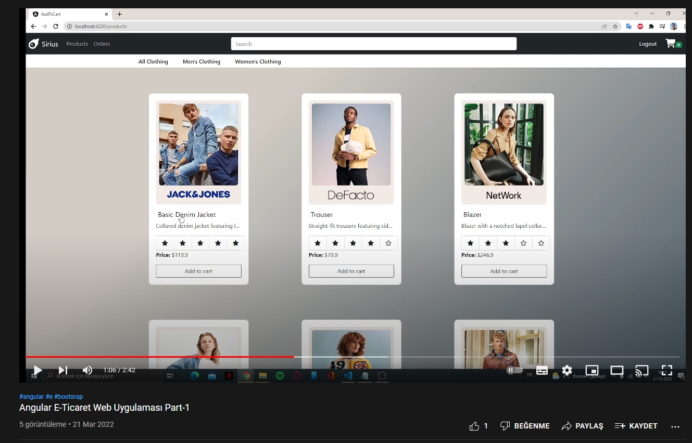

<h1 align="center">Angular E-commerce Web Application</h1>

<h3 align="center">Languages and Tools:</h3>

   </a>    

## Contents:
 - [Categories](#categories)
      - [Video](#video)
      - [About](#about-project)
      - [Used Packages And Modules](#used-packages-and-modules)
      - [Getting Started](#getting-started)
      - [Prerequisites](#prerequisites)
     
## Video
<strong>Click the picture below for watching video on youtube. You will able see how website is working.</strong>

## About Project
 Angular e-commerce web application project for bootcamp assignment.
 
## Used Packages And Modules

- AppRoutingModule
- HttpClientModule
- FormsModule
- ReactiveFormsModule
- Font Awesome
- Bootstrap 5
- AuthGuard

## Getting Started

:rocket: Run `npm i or npm install` to install all packages then install start fake server json api with `npm install -g json-server`then start server `json-server --watch db.json` then finally for compling and starting page `ng serve --o`.

## Prerequisites
- JSON Api
- npm
- Angular 13
- Bootstrap 5
- Vs Code

Ürün satışının, kullanıcı kaydının ve girişinin yapıldığı, web uygulaması geliştirilecek.

<strong>Fonksiyoneliteler: </strong>

• Uygulama responsive tasarımı desteklemeli, mobil ve bilgisayar ekranlarına uyumlu 
çalışmalı (ui component frameworkleri, libraryleri kullanılabilir)  
• Kullanıcılar uygulamaya üye olabilmeli ve giriş yapabilmeli (json dosyasına kayıt 
oluşturulup, json dosyasından doğrulama yapılabilir, ya da ekstra bir api yazılabilir)  
• Ürün kartında bulunması gerekenler; ürünlerin resmi, adı, açıklaması ve fiyatı  
• Ürün listesi ana sayfada gösterilmeli, kullanıcılar isterlerse ürünlerin detayına, 
ürünlerin üzerine tıklayarak bakabilmeli  
• Ürünlerin detay sayfasında, ürünün daha büyük bir resmi ve daha detaylı bir açıklama 
metni olmalı  
• Ürünlerin filtrelenmesi için; kategori seçeneği (dropdown, selector, kategorileri siz 
belirlemelisiniz) ve bir arama çubuğu oluşturulmalı, anahtar kelimesinin ürün adında 
geçip geçmediğine bakılmalı  
• Ürün detayına gidilirken, sayfa yönlendirilmesi (routing) yapılmalı  
• Ürünler kendinizin belirleyeceği bir json kaynak dosyasından alınmalı  
• Ürünler sepete eklenip daha sonrasında satış işlemi gerçekleştirilmeli  
• Satış işlemi için ayrı bir json dosyasına log kaydı atılması yeterli  
• Kullanıcı sisteme giriş yapmadan ürünleri görmemeli  

<strong>Gereklilikler: </strong>

• Reactive form yaklaşımı kullanılmalı  
• Form işlemlerinde validasyon yönetimi yapılmalı ve kullanıcı dostu bir uyarı mesajı 
üretilmeli  
• Http istekleri için HttpClient paketi kullanılmalı  
• Comment kullanımına dikkat edilmeli  
• TypeScript özelliklerinden type ve access modifiers kullanımına dikkat edilmeli  

<strong>Ekstralar: </strong>

• Ürünlerin detay kısmında, ürün ile ilgili oluşturulacak dummy(sahte) yorumların ve 
değerlendirmelerin görüntülenmesi  
• Component mimarisinin anlaşılır, tekrar kullanılabilecek şekilde kurgulanması  

Teknolojiler: Angular (13), JavaScript, TypeScript
